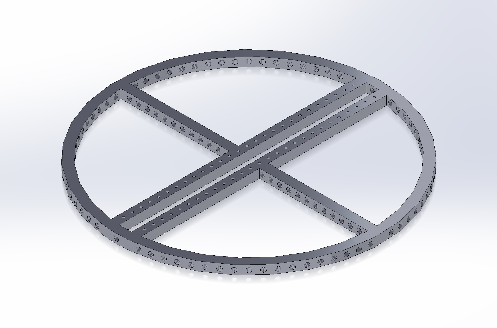

# 1701QCA Making Interaction - Assessment 2 workbook

You will use this workbook to keep track of your progress through the course and also as a process journal to document the making of your projects. The comments in italics throughout the template give suggestions about what to include. Feel free to delete those instructions when you have completed the sections.

When you have completed the template, submit the link to the GitHub Pages site for this repository as a link in Learning@Griffith. The link should be something like [https://qcainteractivemedia.github.io/1701QCA-Assessment2/](https://qcainteractivemedia.github.io/1701QCA-Assessment2/) where `qcainteractivemedia` is replaced with your GitHub username and `1701QCA-Assessment2` is replaced with whatever you called the repository this template is contained in when you set it up.

## Project working title ##
Interactive Persistence of Vision Globe

## Related projects ##
*Find about 6 related projects to the project you choose. A project might be related through  function, technology, materials, fabrication, concept, or code. Don't forget to place an image of the related project in the appropriate folder and insert the filename in the appropriate places below. Copy the markdown block of code below for each project you are showing.*

### Related project 1 ###
*Insert name of project*

*Insert URL to project*

This project is related to mine because *insert reasons here*.

## Other research ##
*Include here any other relevant research you have done. This might include identifying readings, tutorials, videos, technical documents, or other resources that have been helpful. For each particular source, add a comment or two about why it is relevant or what you have taken from it.*

### *Brief resource name/description* ###

*Provide a link, reference, or whatever is required for somebody else to find the resource. Then provide a few comments about what you have drawn from the resource.*

## Conceptual progress ##

### Design intent 1 ###
*A digital analogue clock with remote interface*

### Design concept 1 ###

*Two analogue clock arms (minute hand and hour hand) with digital displays at the tip of each displaying digits representing time. Basic clock functions like alarm and set-time can be acheived using a remote control/interface*

I had plans on focusing on this concept and had spent a considerable amount of time exploring design and fabrication technologies to see it materialise. However, due to the C-19 situation, it became apparent that accessing required fabrication machinery and part logistics was not going to be achievable in the timeframe. 

I had taken the prototype as far as currently possible; having designed the parts to be fabricated in SolidWorks, and placing orders for the various electronic componentry that is needed including low-profile NEMA stepper motors, side-lit fibre optic cable, circular LCD displays and hollow slip-ring capsule. A quote was sought from a Chinese CNC machining service to fabricate the anodised aluminium parts however this was far more expensive than I had anticipated. The quote for a single clock-face was $1000 USD + $150 USD shipping! Obviously severely overpriced given I sourced 6060 aluminium plates for the 3 parts from another Chinese supplier and this was only going to cost $100 including shipping. So I will probably go down this route and use a local CNC and anodising service (there are a number of local workshops providing prototyping services).

                |                  
---------------------- | ---------------------- 
 | 
 

At the heart of the clock is the Micro:Bit and the new HD Halo breakout board which contains a plethora of added features including 60 tiny 'ZIP' RGB LED's, a real-time clock, a microphone and a traditional AA battery cage mounted on the back to name a few. I thought about how I could expand on this and began trawling through my arsenal of electronic paraphenalia for inspiration. I found a meter of 2mm side-lit optic fibre and immediately contemplated using this with the onboard LEDs. I ordered another 5m and set about designing the clock 'face-plate' that would accommodate lengths of optic fibre for each of the 60 LEDs. The idea being that this would represent the second-hand illuminating each in sequence to enhance the visual effect of the clock.

I wanted to show off the electronic core; leaving it exposed for display. I set about deriving various dimensions from the key components on the board which would dictate the size of the face-plate central hole - enshrouding the central microbit and leaving sufficient coverage at the edge containing the LEDs. The existing bore-holes on the Halo would be used for mounting the plate to. Attention was paid to the offset required to align each of the LEDs with the slits required for aligning the embedded optic fibre so that the start of each slit is directly over the LED. The end-face of the fibre would be aligned perpendicular - protruding from the face-plate directly above the LED to ensure full illumination along the lengths of optic fibre. Black heat-shrink tubing would be used over these protruding ends to ensure the light doesn't contaminate neighboring fibres.

Then the idea of using motor-driven arms came about with a couple of 12CH capsule slip-rings I had, though after some consideration realised there would be an issue having these operate in tandem; supplying each of the arms signals and power for any electronics to act independent and unhindered of the movement. A little research located a possible solution, utilising a bore-hole (hollow) slip ring. The bore-hole ring would allow me to use one of the existing rings to feed through the hole allowing two armatures to operate independently as required. 

Another two low-profile NEMA stepper motors were ordered to drive the armatures. Close inspection of the Halo's battery cage reveals that it could easily be detached from the board as it is merely attached with two nut/bolt assemblies and two soldered wires. It is bulky and I would rather remove it and use the space to support motors and other supporting electronics. The board designers were considerate enough to provide solder pads to power the board + Micro:Bit via a 5V connection, so I'll probably add a surface mount JST connector here so I can attach a LiPo battery. 

I wanted to use some mechanism to display the digits of time as each arm moved through its programmed rotation and a brief virtual trip down the Aliexpress mall found some small circular LCD displays complete with driving module. I promptly ordered a pair and used the dimensions conveniently provided by the supplier to drive the armature design.

                |                  |  
---------------------- | ---------------------- | ----------------------
 |  | 
 
This is a project that I will continue developing beyond this course, when global circumstances return to normal.

### Design concept 2 ###
*The clock uses a POV display to create the illusion of an analogue clock face. Clock functions are achieved with voice control.*

### Design concept 3 ###
*The clock uses side-lit fibre optic cable to illuminate time in a format analogous to an analogue clock. Clock is controlled using a smart phone App.*

### Final Design intent ###
*A 3D POV display that can play mpg files.*

### Final design concept ###

Given the issues with moving forward with the original design intent/concept as noted above, I have switched direction to attempt this project which is potentially within the realms of possibility within the timeframe. 

I've been toying with this idea for a few years now and will attempt to use this opportunity to build it. 

Once more I've had to compromise on the design to address the current challenges with fabrication. Specifically, the original idea was to 3D print a LARGE (300mm) circular frame which would house the electronics and LED's... unfortunately, the machines available to us limits this to a maximum diameter of 215mm. This will be adequate for prototyping it for this class but not what I would like to achieve ultimately; since I envisage using this to display my moving-image productions in a gallery setting. The limiting factor is the size of the circular frame and the density of pixels (LEDs) housed on its circumference. The more dense the pixels, the greater the display resolution.

I designed the 3D print model using SolidWorks, and emailed tech support the STL file for printing. The design was based on one that I had seen at https://www.instructables.com/id/POV-Globe-24bit-True-Color-and-Simple-HW/.

My design includes holes down the central supports for easy attachment of the control circuitry. The print took about 5 hours to fabricate and I received it in the post the next day. Even at 50% infill, it is surprisingly rigid - weighing about 90g.

I had found a Chinese supplier (as noted on the Discussion Board) who can manufacture a 5mm wide APA102 2020 RGB LED strip with a 200 LEDs/m density but his minimum order is 5m with a door-to-door delivery price of ~$300 AUD. While tempting, I might hold off on this purchase for now until I have succeeded building a prototype with the materials on hand.

                |                  
---------------------- | ---------------------- 
 | 
  
I have on hand an APA102 5050 144 LED/m strip which was purchased several years ago for this purpose and given the frame circumference, will provide around 96 pixels. It is the waterproof version so has been embedded in silicone which adds to the weight; and unfortunately has started to yellow slightly - though will do for this project.

                |                  |  
---------------------- | ---------------------- | ----------------------
 |  | 
 

I set up the rPi0W in *headless* mode - basically allowing it to operate without tethering to monitor, keyboard and mouse. I use Putty to remote into the device and proceed to set up the required system environment. I will enable VNC server so that I can remote-desktop into it for a GUI experience when it comes to using the Arduino IDE.

I install the latest Arduino IDE on the rPi0W - currently v1.8.12. This will provide access to fast C libraries - significantly faster than using Python and *should* be sufficient to provide the pipeline grunt needed to downsample MPG files. Additional libraries will be required to provide the physical communication between the rPi0W and the APA102 LEDs (namely the Adafruit Dotstar library), but I may add a Teensy 3.5/3.6 SBC if the Pi struggles with the streaming task. Fortunately, there are support libraries for this board available via the Arduino IDE as well.  

The rPi0W has on-board WiFi and Bluetooth capabilities, so it is a trivial task transferring files across to it as required.

The next step will be to test the LED strip hooked up to the Pi and a 5V power source. The finished device will separate the controller system (with its own dedicated LiPo battery; completely housed on the rotating frame) from the driving motor unit and its power-supply and controlling unit housed in the base unit. This is necessary since using a power supply to support the rotating electronics would require a high-speed slip-ring which are prohibitively expensive. Separating these means that the motor can be switched on/off independent of the display system - allowing the user to switch on the boot up and initialise the systemhttps://learn.adafruit.com/pages/6062/elements/1376624/download?type=zip before switching on the kinetic mechanism.

                |                  
---------------------- | ---------------------- 
 |  

I have designed the support framework in SolidWorks with the intention of manufacturing in steel or combination steel and aluminium. A quote has been sought and the cost may determine if the project goes ahead or not.

*This more fully developed concept should include consideration of the interaction scheme, technical functionality, fabrication approach, materials to be used, and aesthetic.*

## Physical experimentation documentation ##

A quick and dirty jig was created out of timber to test out the stepper motor, pulley and frame assembly - using an Arduino UNO board and a stepper motor shield. After testing all configurations of the stepper motor driver, it was determined not to be fast enough for this task. I have instead ordered a larger 12V 30W 3000 rpm DC motor which will be mounted on a 300mm x 300mm x 20mm steel plate which I purchased from a local steel supply company. It is a hefty piece which will give good anchorage to the construction. The new motor is a local order so should be arriving any day. I had not been successful getting quotes to build the support structures so have decided to do it myself. I'll be using a modular 20mm x 20mm anodised aluminium extrusion with cast aluminium brackets. I had thought about using a t-slot system, but my local supplier is awaiting shipment which has been delayed due to C-19. I'm stuck in limbo until the motor arrives as I need to find a mounting bracket for it - but should be clear sailing once it does.

                |                  |  
---------------------- | ---------------------- | ----------------------
 |  | 
 
I've started construction of the framework, with the aim to create a very robust and rigid housing for the globe. Beginning with the drilling and mounting of the cast aluminium angle brackets. The metalwork is thoroughly cleaned before being coated in a black satin-finish metal enamel. Four hours later, the reverse side is done. The aluminium is cut to size and the sections joined using pre-fab heavy duty plastic corner joiners. Large clear rubber stoppers will be glued to the bottom surface - providing a shock-absorbing cushion to the device.

The motor and LiPo battery charger module arrived today, so that will be the next thing to tackle. First I need to locate some rubber mat or similar to be used as a gasket - providing a buffer between the metal plate and the motor, as well as some threaded 4mm rod so that I can customize the lengths needed to secure the motor to the plate. This will replace the existing M4 bolts that connect the base plate with the top plate.
 
                |                  |                  |                  
---------------------- | ---------------------- | ---------------------- | ----------------------
 |  |  | 

                |                  
---------------------- | ---------------------- 
 |  

OK, so I've finally got the infrastructure sorted. I took the steel plate to Scotts Metal at Woolloongabba to get the holes drilled for mounting the motor. Holes were drilled for the clear rubber stoppers at each of the four corners on the bottom face of the base-plate. The screws were used as anchors in the holes filled with glue. 

The screws holding the bottom and top plates together on the motor were removed so that I could custom cut threaded rod for it which is threaded through the bottom of the steel plate, up through the holes in the bottom of the motor and screwed through the top plate. A piece of neoprene rubber is cut as a gasket and slipped between the base-plate and the motor's bottom plate. The threaded rod is then cut and locked tight with self-locking nuts on both ends.

Next, I spray paint the 3D print matt black so now the bulk of the mechanical structure is black and unobtrusive.

The carbon fiber rod is cut to length, pushed through the central roles in the 3D print and glued in place.

A hole is cut in the internal face of the top aluminium beam to house the bearing.

The bearing is pushed over the top end of the carbon fibre rod, the bottom end of the rod is placed in the coupler, then the bearing pushed up into hole.

Time for the first test!

The motor leads are connected to the lab power and cranked up. Video showing this below...

I'm thrilled at the smooth operation of the motor/orbital housing assembly - there are no vibrations and it's virtually quiet apart from the sound of the air movement.

Next, I wire up the APA102 RGB LED strip to the raspberry pi zero w and run a basic python script to test that the LEDs are actually working... no sign of life. I then use an Arduino UNO, wire up the strip and upload a test script... this time all the LEDs illuminate but the UNO continuously shorts and reboots. Not a good sign! Next, I cut the strip in half hoping that the line error is occurring in that section. Still shorting :( I shorten the strip to the size needed for the project, and again the UNO is shorting. Panic sets in... what can I do? I pull out my old LightStick project as it too used an APA102 strip however it is glued fast to the aluminium bar and there is no way I can remove it without destroying it.

At this point, I've resigned to the fact that the strip has been sitting around too long (about 5 years) so decide to buy a last-minute replacement. Have ordered a half-meter strip from au-rs-online.com and it should be here within 5 days... 

In the meantime, I have installed piduino on my windows machine so that I can cross-compile arduino sketches that can run on the Raspberry Pi. This will allow me to develop C code on the PC which will run very efficiently as opposed to python which is interpreted - and on a little RPi0W that will make all the difference to the system running or not. However, I would ideally like to develop an Android app in React Native to provide an easy-to-use GUI allowing user files to be uploaded to the pi and displayed. Realistically, this isn't likely to happen in time although it is something I will definately be implementing to finish the project - if not in time for this assessment.

Have been going crazy trying to get all components working on a single MCU. Have a LOLIN32 which I can communicate over Bluetooth with from my underdevelopment phone app, but is incompatible with the FastLED library and for which there doesn't appear to be a solution. Have tried 
Raspberry Pi Zero W but there is issues getting Arduino code running on it from cross-compiled code. Have tried an Adafruit Feather HUZZAH ESP8266 board but it has library incompatibilities with FastLED in addition to it being limited to 3.3v logic. 

Given the LOLIN32 gives me both external (fast) interrupt handling and bluetooth for phone comms, and given the Adafruit Dotstar library will work with it I will attempt to use this instead of FastLED.

I have also been developing the Android phone app and have tested communication between it and the LOLIN32 - so at least this works and I can send text (for now) which I'd like to have for demonstration... clearly I will not be able to deliver MPEG as was my original intent.

### BoM ###

* 300mm x 300mm x 20mm steel plate - 46.0
* 2 x 20mm aluminium angle brackets - 8.0
* 20mm x 20mm x 1800mm black anodised aluminium tubing - 26.0
* Black satin spray paint - 18.0
* NEMA 17 low profile stepper motor - 26.0
* A4988 Step Stick Stepper Motor Driver Module With Heatsink - 6.0
* TP4056 5V Micro USB Lithium Bat Charging NEW Improved LiPo Charger Mod - 4.0
* 12v 30w dc motor - 24.0
* 8mm to 5mm coupler - 16.0
* 2 x 5mm x 10mm ball bearings - 10.0
* raspberry pi zero wifi - 16.0
* APA102 rgb led strip 144/m - 30.0
* series 500 self drilling screws - 8.0
* washers - 4.0
* M4 bolts with self locking nuts - 4.0
* 3mm x 50mm x 1m neoprene rubber - 8.0
* 5mm x 1m carbon fibre rod - 16.0
* M4 self locking nuts - 4.0
* 4mm x 1m threaded rod - 3.0

*In this section, show your progress including whichever of the following are appropriate for your project at this point.
a.	Technical development. Could be code screenshots, pictures of electronics and hardware testing, video of tests. 
b.	Fabrication. Physical models, rough prototypes, sketches, diagrams of form, material considerations, mood boards, etc.
Ensure you include comments about the choices you've made along the way.*

*You will probably have a range of images and screenshots. Any test videos should be uploaded to YouTube or other publicly accessible site and a link provided here.*

### Interaction flowchart ###
*Draw a draft flowchart of what you anticipate the interaction process in your project to be. Make sure you think about all the stages of interaction step-by-step. Also make sure that you consider actions a user might take that aren't what you intend in an ideal use case. Insert an image of it below. It might just be a photo of a hand-drawn sketch, not a carefully drawn digital diagram. It just needs to be legible.*

## Design process discussion ##
*Discuss your process in getting to this point, particularly with reference to aspects of the Double Diamond design methodology or other relevant design process.*

## Next steps ##
*Write a list or provide other information about your plan to move the project forward to be ready to present by video and documentation in week 12 of the course.*
